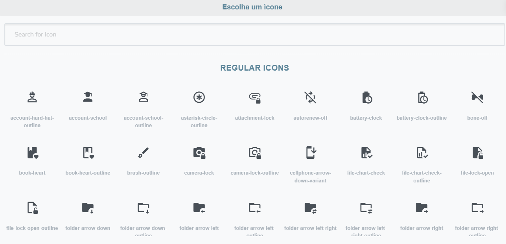

# VueAwesomeIconPicker

A Vue.js icon picker component to easily pick a FontAwesome 5 Icon & use it.




## Table of contents

- [Installation](#installation)
- [Usage](#usage)
- [Configuration](#configuration)
    - [Options](#options)
- [Events](#events)

## Installation

Install using `npm`   

```
npm install --save @rightbraintechbd/vue-awesome-icon-picker
```

OR use it via `cdn`   

```html
<script src="https://unpkg.com/@rightbraintechbd/vue-awesome-icon-picker@1.1.0/dist/vue-awesome-icon-picker.min.js"></script>
```

Then Register The Component Globally:

```javascript
import Vue from 'vue';
import VueAwesomeIconPicker from '@rightbraintechbd/vue-awesome-icon-picker';

Vue.component('vue-awesome-icon-picker', VueAwesomeIconPicker)
```

OR use it in a Component:

```javascript
import VueAwesomeIconPicker from '@rightbraintechbd/vue-awesome-icon-picker';

export default {
    name: 'YourAwesomeComponent',
    components: {
        'vue-awesome-icon-picker': VueAwesomeIconPicker
    },
}
```


## Usage

Use it like:

```html
<vue-awesome-icon-picker />
```


## Configuration

You can also pass Options as props in the `vue-awesome-icon-picker` component as you can see the example below

```html
<vue-awesome-icon-picker :icon-preview="false" />
```
Remember that all options are optional and you can check the default values below:

### Options

```javascript
/**
 * The Text which will be shown to the Select Icon Button
 */
button: {
    type: String,
    default: 'Pick A Icon'
},
/**
 * Header Title
 */
title: {
    type: String,
    default: 'Vue Awesome Icon Picker'
},
/**
 * Whether the Icon should displayed or not
 */
iconPreview: {
    type: Boolean,
    default: true
}
```

## Events

VueAwesomeIconPicker will emit a `selected(icon)` event when user selects an icon.

```html
<vue-awesome-icon-picker @selected="onIconSelected" />
```

```javascript
{
    methods: {
        onIconSelected(icon) {
            // your code here
        }
    }
}
```

It will emit an `Object` containing icon data like `{ type, name }` 

```javascript
{ type: 'fab', name: 'facebook' }
```

[MIT](http://opensource.org/licenses/MIT)